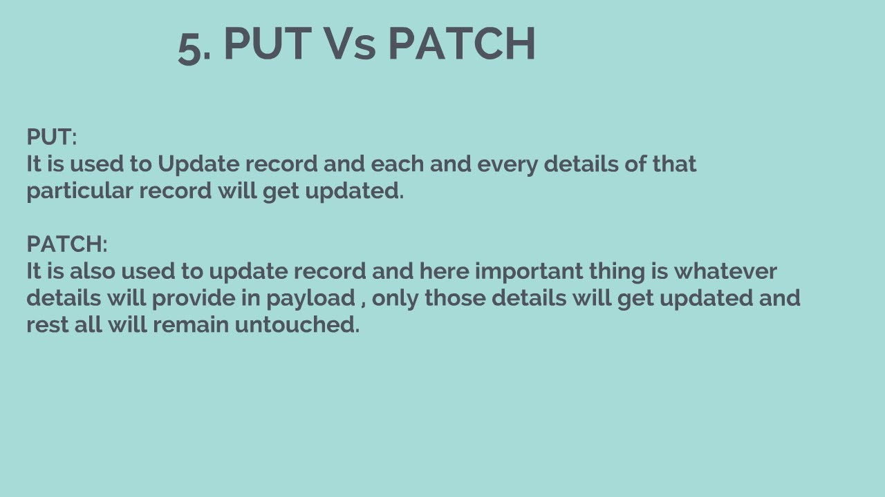

 
 # What’s the difference between PUT and PATCH

PUT method use the request URI to supply a modified version of the requested resource which replaces the original version of the resource, where’s the PATCH method supplies a set of instructions to modify the resource.

# Provide links to 3 services or tools that allow you to mock an API for development like `json-server`
1. **Nock**:is an HTTPS library designed to replicate and mock servers and expectations in `Node.js`.
>Link:
    - `https://github.com/nock/nock`
2. **Beeceptor**:is a free online tool for mocking a `REST API` interaction using any HTTP request. 
>Link:
    - `https://beeceptor.com/`
3.  **Stoplight**: is all about the quick creation of mock servers and visualization of the `APIs` that interact with them. 
>Link:
    - `https://stoplight.io/mocking/`

# Compare and contrast SOAP and ReST : (Links to an external site.)

1. `SOAP` is a XML-based message protocol, while `REST` is an architectural style
2. `SOAP` uses WSDL for communication between consumer and provider, whereas `REST` just uses XML or JSON to send and receive data
3. `SOAP` invokes services by calling RPC method, `REST` just simply calls services via URL path
4. `SOAP` doesn't return human readable result, whilst `REST` result is readable with is just plain XML or JSON
5. `SOAP` is not just over HTTP, it also uses other protocols such as SMTP, FTP, etc, `REST` is over only HTTP

# Document the following Vocabulary Terms

1- Web Server
A web server is the technology that serves up a website to users when they visit a URL. On the technical side of things, what that means is that it handles the hypertext transfer protocol (HTTP)

2- Express
Web Applications Express is a minimal and flexible Node.js web application framework that provides a robust set of features for web and mobile applications.

3- Routing
Routing is responsible for matching incoming HTTP requests and dispatching those requests to the app’s executable endpoints. Endpoints are the app’s units of executable request-handling code. Endpoints are defined in the app and configured when the app starts. The endpoint matching process can extract values from the request’s URL and provide those values for request processing. Using endpoint information from the app, routing is also able to generate URLs that map to endpoint